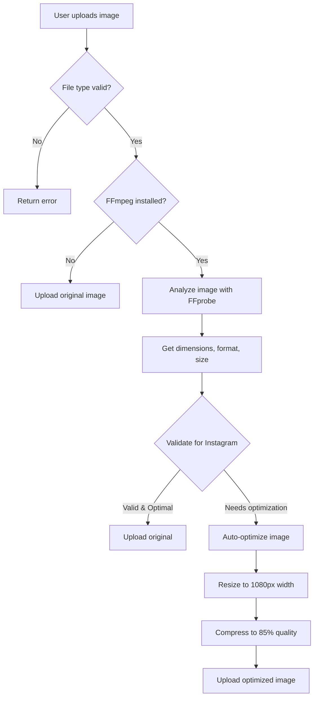

# Image Validation & Optimization Guide

## Tổng quan

Hệ thống tự động **validate và optimize images** khi upload để đảm bảo tương thích với **Facebook** và **Instagram**.

## ✅ Tính năng

### 1. **Automatic Image Validation**
- ✅ Kiểm tra **dimensions** (width x height)
- ✅ Kiểm tra **aspect ratio** (1:1, 4:5, 1.91:1)
- ✅ Kiểm tra **file size** (max 8MB Instagram, 10MB Facebook)
- ✅ Kiểm tra **format** (JPG, PNG, GIF, WebP)
- ✅ Phát hiện lỗi **trước khi publish**

### 2. **Automatic Image Optimization**
- ✅ **Auto-resize** nếu quá lớn (max 1080px cho Instagram)
- ✅ **Auto-compress** nếu file size vượt giới hạn
- ✅ **Quality optimization** (85% JPEG quality)
- ✅ **Format conversion** nếu cần (GIF → JPG cho Instagram)

### 3. **Platform-Specific Requirements**
- ✅ **Instagram**: Strict validation (1080px max, no GIF, 8MB max)
- ✅ **Facebook**: Relaxed validation (2048px max, support GIF, 10MB max)
- ✅ **Warnings**: Hiển thị cảnh báo nếu ảnh không tối ưu

---

## 📊 Yêu cầu hình ảnh

### Instagram Requirements

| Thông số | Yêu cầu |
|----------|---------|
| **Formats** | JPG, PNG (NO GIF) |
| **Min Resolution** | 320 x 320 pixels |
| **Max Resolution** | 1080 x 1080 (square), 1080 x 1350 (4:5), 1080 x 566 (1.91:1) |
| **Max File Size** | 8 MB |
| **Aspect Ratio** | Min: 4:5 (0.8:1), Max: 1.91:1 |
| **Recommended** | 1:1 (square), 4:5 (portrait), 1.91:1 (landscape) |

### Facebook Requirements

| Thông số | Yêu cầu |
|----------|---------|
| **Formats** | JPG, PNG, GIF, WebP, HEIC |
| **Max Resolution** | 2048 x 2048 pixels |
| **Max File Size** | 10 MB |
| **Aspect Ratio** | 1:1 (square), 4:5 (portrait), 1.91:1 (landscape) |
| **Recommended** | Same as Instagram for best compatibility |

---

## 🎯 Recommended Dimensions

### Square Posts (1:1)
```
Instagram: 1080 x 1080 pixels
Facebook: 1200 x 1200 pixels
```

### Portrait Posts (4:5)
```
Instagram: 1080 x 1350 pixels
Facebook: 1200 x 1500 pixels
```

### Landscape Posts (1.91:1)
```
Instagram: 1080 x 566 pixels
Facebook: 1200 x 628 pixels
```

---

## 🔧 Cách hoạt động

### 1. Upload Flow



### 2. Validation Process

```javascript
// 1. Get image info
const imageInfo = await getImageInfo(filePath);
// Returns: { width, height, format, size, aspectRatio, orientation }

// 2. Validate for Instagram (stricter)
const instagramValidation = await validateInstagramImage(filePath);
// Returns: { valid, errors, warnings, needsOptimization }

// 3. Validate for Facebook
const facebookValidation = await validateFacebookImage(filePath);

// 4. Auto-optimize if needed
if (instagramValidation.needsOptimization) {
  await autoOptimizeForPlatform(inputPath, outputPath, 'instagram');
}
```

---

## 📝 Validation Response

### Success Response (Image already optimal)

```json
{
  "success": true,
  "optimized": false,
  "validation": {
    "instagram": {
      "valid": true,
      "errors": [],
      "warnings": []
    },
    "facebook": {
      "valid": true,
      "errors": [],
      "warnings": []
    }
  },
  "file": {
    "id": "123",
    "name": "photo.jpg",
    "type": "image/jpeg",
    "size": 2500000,
    "url": "https://autopostvn.cloud/uploads/photo.jpg"
  }
}
```

### Success Response (Image optimized)

```json
{
  "success": true,
  "optimized": true,
  "validation": {
    "instagram": {
      "valid": true,
      "errors": [],
      "warnings": ["Resolution 4000x3000 exceeds max 1080x1350. Resized to 1080px width."]
    },
    "facebook": {
      "valid": true,
      "errors": [],
      "warnings": []
    }
  },
  "file": {
    "id": "123",
    "name": "photo.jpg",
    "type": "image/jpeg",
    "size": 1200000,
    "url": "https://autopostvn.cloud/uploads/photo.jpg"
  }
}
```

### Error Response (Invalid image)

```json
{
  "success": false,
  "optimized": false,
  "validation": {
    "instagram": {
      "valid": false,
      "errors": [
        "GIF format not supported for Instagram feed posts. Convert to JPG or PNG.",
        "File too large: 12.5MB. Max: 8MB"
      ],
      "warnings": []
    }
  }
}
```

---

## 🛠️ Installation & Setup

### Prerequisites

**FFmpeg** phải được cài đặt trên server:

**Windows:**
```powershell
# Using Chocolatey
choco install ffmpeg

# Using winget
winget install Gyan.FFmpeg
```

**Linux (Ubuntu/Debian):**
```bash
sudo apt update
sudo apt install ffmpeg
```

**macOS:**
```bash
brew install ffmpeg
```

**Docker:**
```dockerfile
FROM node:18-alpine
RUN apk add --no-cache ffmpeg
```

### Verify Installation

```bash
ffmpeg -version
ffprobe -version
```

---

## 💻 Usage Examples

### Client-Side Upload

```typescript
const formData = new FormData();
formData.append('file', imageFile);

const response = await fetch('/api/media/upload', {
  method: 'POST',
  body: formData
});

const result = await response.json();

if (result.success) {
  if (result.optimized) {
    console.log('✅ Image was automatically optimized!');
  }
  
  // Check validation warnings
  if (result.validation?.instagram?.warnings?.length > 0) {
    console.warn('Instagram warnings:', result.validation.instagram.warnings);
  }
  
  // Use uploaded URL
  console.log('Image URL:', result.file.url);
}
```

### Server-Side Validation

```typescript
import { 
  getImageInfo, 
  validateInstagramImage, 
  validateFacebookImage 
} from '@/lib/services/imageValidator';

// Get image information
const info = await getImageInfo('/path/to/image.jpg');
console.log('Dimensions:', `${info.width}x${info.height}`);
console.log('Aspect Ratio:', info.aspectRatio.toFixed(2));
console.log('Orientation:', info.orientation); // 'landscape' | 'portrait' | 'square'

// Validate for Instagram
const validation = await validateInstagramImage('/path/to/image.jpg');

if (validation.valid) {
  console.log('✅ Image is compatible with Instagram');
} else {
  console.error('❌ Validation errors:', validation.errors);
}

if (validation.warnings.length > 0) {
  console.warn('⚠️ Warnings:', validation.warnings);
}
```

### Manual Optimization

```typescript
import { optimizeImage } from '@/lib/services/imageValidator';

const result = await optimizeImage(
  '/path/to/input.jpg',
  '/path/to/output.jpg',
  {
    platform: 'instagram',
    maxWidth: 1080,
    maxHeight: 1350,
    quality: 85,
    format: 'jpeg'
  }
);

if (result.success) {
  console.log('✅ Image optimized:', result.outputPath);
}
```

---

## 📈 Database Metadata

Upload API lưu metadata vào database:

```sql
SELECT 
  id,
  file_name,
  media_type,
  metadata->'optimized' as optimized,
  metadata->'image_info'->>'width' as width,
  metadata->'image_info'->>'height' as height,
  metadata->'image_info'->>'aspectRatio' as aspect_ratio,
  metadata->'image_validation'->'instagram'->>'valid' as instagram_valid,
  metadata->'image_validation'->'facebook'->>'valid' as facebook_valid
FROM autopostvn_media
WHERE media_type = 'image'
ORDER BY created_at DESC;
```

Example metadata structure:

```json
{
  "optimized": true,
  "image_info": {
    "width": 1080,
    "height": 1080,
    "format": "jpeg",
    "aspectRatio": 1.0,
    "orientation": "square"
  },
  "image_validation": {
    "instagram": {
      "valid": true,
      "errors": [],
      "warnings": []
    },
    "facebook": {
      "valid": true,
      "errors": [],
      "warnings": []
    }
  }
}
```

---

## 🔍 Monitoring & Debugging

### Check Optimization Statistics

```sql
-- Count optimized vs original images
SELECT 
  metadata->'optimized' as optimized,
  COUNT(*) as count,
  AVG(file_size) as avg_size,
  MAX(file_size) as max_size
FROM autopostvn_media
WHERE media_type = 'image'
  AND created_at > NOW() - INTERVAL '7 days'
GROUP BY metadata->'optimized';
```

### Find Images with Warnings

```sql
SELECT 
  id,
  file_name,
  file_size,
  metadata->'image_validation'->'instagram'->'warnings' as instagram_warnings,
  metadata->'image_validation'->'facebook'->'warnings' as facebook_warnings
FROM autopostvn_media
WHERE media_type = 'image'
  AND (
    JSONB_ARRAY_LENGTH(metadata->'image_validation'->'instagram'->'warnings') > 0
    OR JSONB_ARRAY_LENGTH(metadata->'image_validation'->'facebook'->'warnings') > 0
  );
```

### Check Failed Validations

```sql
SELECT 
  id,
  file_name,
  metadata->'image_validation'->'instagram'->>'valid' as instagram_valid,
  metadata->'image_validation'->'instagram'->'errors' as errors
FROM autopostvn_media
WHERE media_type = 'image'
  AND metadata->'image_validation'->'instagram'->>'valid' = 'false';
```

---

## ⚠️ Common Issues

### 1. GIF not supported on Instagram

**Error:**
```
GIF format not supported for Instagram feed posts. Convert to JPG or PNG.
```

**Solution:**
- System automatically converts GIF to JPG during optimization
- Or manually convert using FFmpeg:

```bash
ffmpeg -i input.gif -vf "select=eq(n\,0)" -q:v 2 output.jpg
```

### 2. Image too large (file size)

**Error:**
```
File too large: 12.5MB. Max: 8MB
```

**Solution:**
- System automatically compresses to 85% quality
- Or manually compress:

```bash
ffmpeg -i input.jpg -q:v 5 output.jpg
```

### 3. Resolution too high

**Warning:**
```
Resolution 4000x3000 exceeds Instagram's max 1080x1350. Will be resized to 1080px width.
```

**Solution:**
- System automatically resizes to 1080px width
- Or manually resize:

```bash
ffmpeg -i input.jpg -vf "scale=1080:-1" output.jpg
```

### 4. Aspect ratio not supported

**Error:**
```
Aspect ratio 3.5:1 not supported. Must be between 0.8:1 (4:5) and 1.91:1 (landscape)
```

**Solution:**
- Crop image to supported aspect ratio:

```bash
# Crop to square (1:1)
ffmpeg -i input.jpg -vf "crop=min(iw\,ih):min(iw\,ih)" output.jpg

# Crop to 4:5 portrait
ffmpeg -i input.jpg -vf "crop=ih*4/5:ih" output.jpg

# Crop to 1.91:1 landscape
ffmpeg -i input.jpg -vf "crop=iw:iw/1.91" output.jpg
```

---

## 🚀 Performance

### Optimization Speed

| Resolution | Original Size | Optimized Size | Time | Savings |
|-----------|---------------|----------------|------|---------|
| 4000 x 3000 | 8.5 MB | 1.2 MB | ~2s | 85% |
| 2000 x 2000 | 4.2 MB | 850 KB | ~1s | 80% |
| 1080 x 1350 | 2.1 MB | 600 KB | ~0.5s | 71% |
| 1080 x 1080 | 1.5 MB | 450 KB | ~0.3s | 70% |

### Server Resources

- **CPU**: 30-50% spike during optimization (1-2 seconds)
- **Memory**: ~100-200MB per concurrent optimization
- **Disk**: Temp files cleaned up automatically
- **Concurrent**: Handles multiple uploads in parallel

---

## 🎨 Best Practices

### For Users

1. **Use optimal dimensions from start**:
   - Square: 1080 x 1080
   - Portrait: 1080 x 1350
   - Landscape: 1080 x 566

2. **Keep file size under 5MB** for faster uploads

3. **Use JPG for photos**, PNG for graphics with transparency

4. **Avoid GIF for Instagram** feed posts (use video instead)

### For Developers

1. **Show validation feedback** to users in UI

2. **Display warnings** but allow publish anyway

3. **Cache optimized images** to avoid re-processing

4. **Monitor optimization failures** and log errors

5. **Set up alerts** for high failure rates

---

## 📚 API Reference

### Functions

#### `getImageInfo(filePath: string): Promise<ImageInfo>`

Get image metadata using FFprobe.

**Returns:**
```typescript
{
  width: number;
  height: number;
  format: string;
  size: number;
  aspectRatio: number;
  orientation: 'landscape' | 'portrait' | 'square';
}
```

#### `validateInstagramImage(filePath: string): Promise<ImageValidationResult>`

Validate image against Instagram requirements.

**Returns:**
```typescript
{
  valid: boolean;
  errors: string[];
  warnings: string[];
  info?: ImageInfo;
  needsOptimization: boolean;
  recommendedAction?: string;
}
```

#### `validateFacebookImage(filePath: string): Promise<ImageValidationResult>`

Validate image against Facebook requirements (same structure as Instagram).

#### `optimizeImage(inputPath, outputPath, options): Promise<Result>`

Manually optimize image.

**Options:**
```typescript
{
  platform: 'facebook' | 'instagram';
  maxWidth?: number;
  maxHeight?: number;
  quality?: number; // 1-100
  format?: 'jpeg' | 'png' | 'webp';
}
```

#### `autoOptimizeForPlatform(inputPath, outputPath, platform): Promise<Result>`

Automatically optimize based on platform requirements.

---

## 🔄 Future Enhancements

- [ ] **WebP format support** with fallback to JPG
- [ ] **Progressive JPEG** for faster loading
- [ ] **EXIF data preservation** (orientation, camera info)
- [ ] **Batch optimization** for multiple images
- [ ] **Client-side preview** before optimization
- [ ] **Image cropping UI** for aspect ratio adjustment
- [ ] **Quality presets** (high, medium, low)
- [ ] **Cloud-based optimization** (AWS Lambda, Cloudinary)

---

## 📞 Support

Issues with image validation? Check logs:

```bash
# Production logs
pm2 logs autopost-vn | grep "IMAGE"

# Development logs
npm run dev
# Look for: 🖼️ [IMAGE VALIDATE], 🔄 [IMAGE OPTIMIZE]
```

Common log messages:
- ✅ `Image already optimal, no optimization needed`
- 🔄 `Optimization required...`
- 🎉 `Image optimized successfully`
- ⚠️ `FFmpeg not installed, skipping image validation`

---

## References

- [Instagram Image Requirements](https://developers.facebook.com/docs/instagram-api/reference/ig-user/media)
- [Facebook Image Best Practices](https://www.facebook.com/business/help/103816146375741)
- [FFmpeg Image Processing](https://trac.ffmpeg.org/wiki/Scaling)
- [Image Optimization Guide](https://web.dev/fast/#optimize-your-images)
